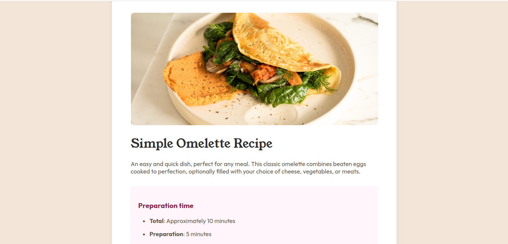
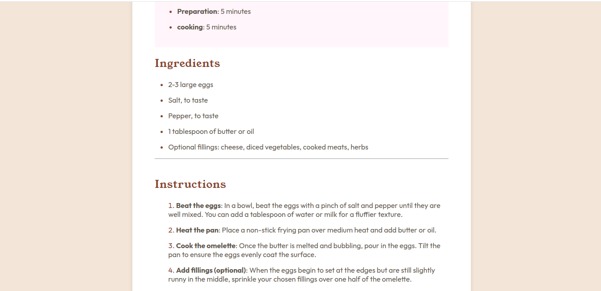
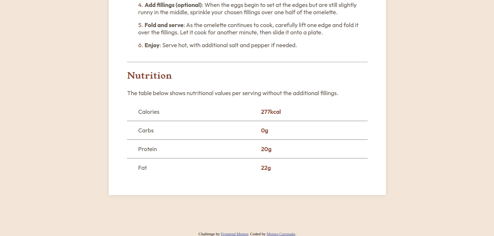

# Frontend Mentor - Recipe page solution

This is a solution to the [Recipe page challenge on Frontend Mentor](https://www.frontendmentor.io/challenges/recipe-page-KiTsR8QQKm). Frontend Mentor challenges help you improve your coding skills by building realistic projects. 

## Table of contents

- [Overview](#overview)
  - [The challenge](#the-challenge)
  - [Screenshot](#screenshot)
- [My process](#my-process)
  - [Built with](#built-with)
  - [What I learned](#what-i-learned)
  - [Continued development](#continued-development)
  - [Useful resources](#useful-resources)
- [Author](#author)

## Overview

The website is about an omelet recipe, it has an image at the top, followed by the title and the preparation time. Next comes the ingredients in an unordered list and then the cooking instructions in an ordered list. At the end you see a table with the nutritional values of the omelet.

### Screenshot

## My process

The process of this project it was very easy because This project is quite short, compared to the other 2 projects I have done. I had some doubts about how to layout the table at the end of the page but I am satisfied, I also had certain difficulties with the lists since I did not understand and do not understand how to make the separation between the bullet and the text so I had to leave it like that.

### Built with

- Semantic HTML5 markup
- CSS custom properties

### What I learned

I don't learn a lot of this project because is quite short but I feel like I'm improving with my layout.

### Continued development

Like my last project in Frontend Mentor I will learn and improve my skills of responsive design.

### Useful resources

- [Resource 1](https://blog.hubspot.es/website/tablas-html#:~:text=Dentro%20del%20lenguaje%20de%20dise%C3%B1o,la%20celda%20de%20la%20tabla.) - This page about basic table information.

## Author

I Haven't web page.
